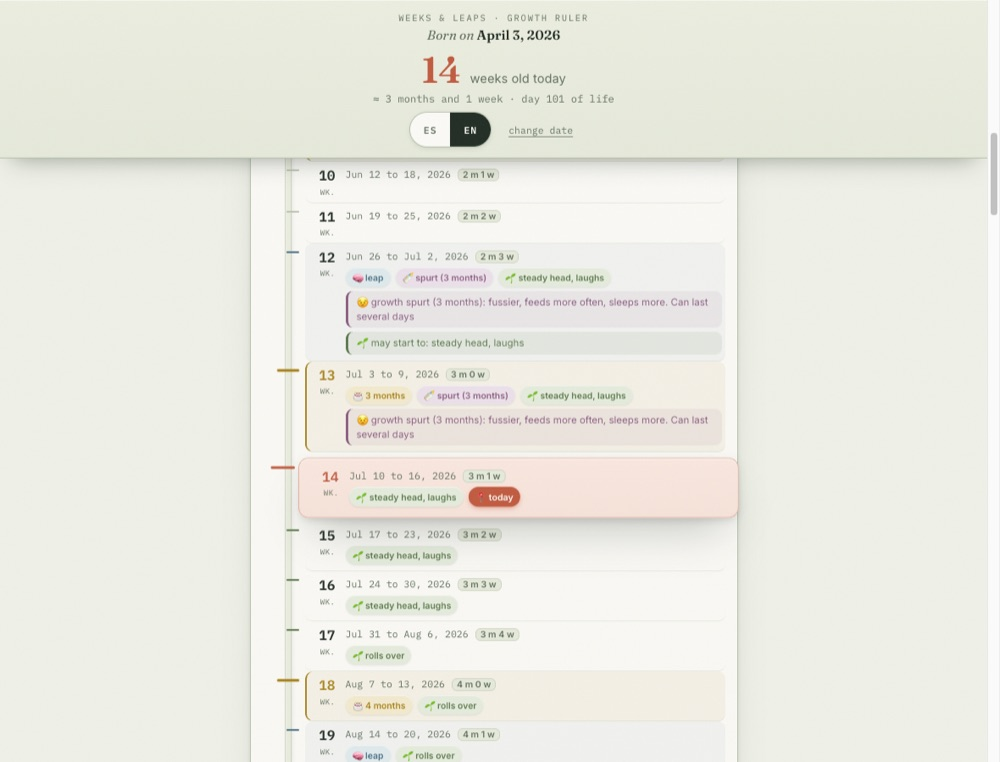
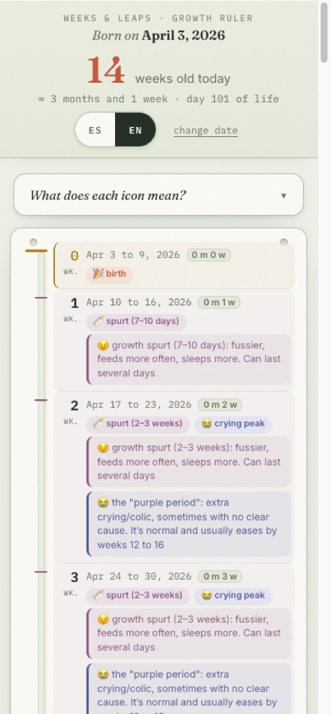
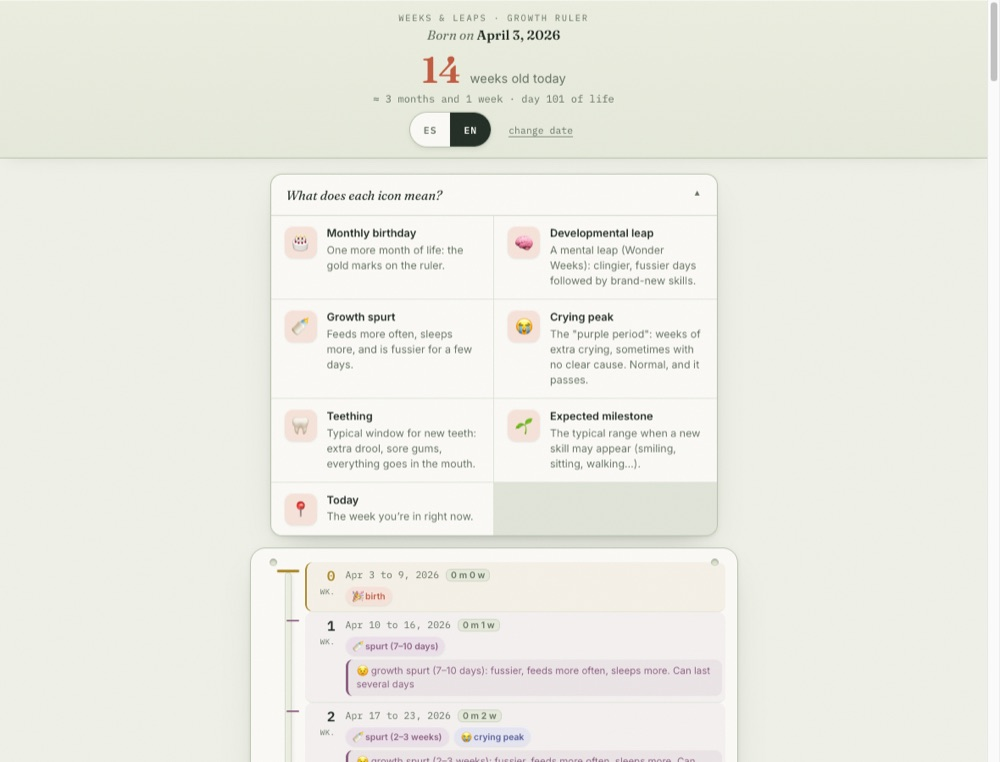

<div align="center">

# 🍼 Weeks & Leaps

**A week-by-week baby growth ruler — from birth to 2 years.**

See what's coming for your baby each week: developmental leaps, growth spurts, teething windows, and expected milestones — all on one scrollable timeline. No accounts, no tracking, works offline.

[](https://web.dev/progressive-web-apps/)
[](#tech)
[](#features)
[](LICENSE)



</div>

## What it is

Enter your baby's birth date once and get a personalized "ruler" of their first 24 months. Each week shows its date range, the baby's age, and any notable events for that week, drawn from widely-used developmental references:

- 🎂 **Monthly birthdays** — the major gradations on the ruler
- 🧠 **Developmental leaps** — the *Wonder Weeks* mental leaps (clingier days, then new skills)
- 🍼 **Growth spurts** — fussier, feeds more often, sleeps more
- 😭 **Crying peak** — the "purple period" of extra crying
- 🦷 **Teething windows** — typical ranges for new teeth
- 🌱 **Expected milestones** — smiling, rolling, sitting, crawling, first words, first steps
- 📍 **Today** — the week you're in right now, highlighted and auto-scrolled into view

<div align="center">

&nbsp;&nbsp;

</div>

## Features

- **Personalized** — the whole timeline adapts to your baby's birth date.
- **Bilingual** — full Spanish 🇪🇸 and English 🇬🇧 with a one-tap toggle; auto-detects your browser language on first visit.
- **Private by design** — the birth date is stored only in your browser's `localStorage`. No accounts, no servers, no analytics, nothing leaves your device.
- **Installable PWA** — "Add to Home Screen" on iOS and Android for a full-screen, app-like experience.
- **Works offline** — a service worker caches the app shell and fonts after the first load.
- **Mobile-first & accessible** — responsive down to ~360px, 44px+ touch targets, honors `prefers-reduced-motion`.
- **A single HTML file** — no framework, no build step, no dependencies to install.

## How it works

Everything lives in [`index.html`](index.html) — markup, styles, and logic in one file. On first load it shows a date picker; once a valid birth date is entered it's saved to `localStorage` under the key `weeksandleaps.v1` and the ruler renders. Week/leap/spurt/teething/milestone data is defined as plain data tables in the script, and the timeline is generated week by week in the browser.

```
weeksandleaps/
├── index.html          # the entire app (UI + logic + i18n data)
├── manifest.json       # PWA manifest
├── sw.js               # service worker (offline app-shell + font cache)
├── icons/              # app icons (SVG sources + rasterized PNGs)
├── og-image.png        # 1200×630 social preview
└── docs/               # screenshots for this README
```

## <a name="tech"></a>Tech

Plain **HTML + CSS + vanilla JavaScript**. No framework, no bundler, no npm install. Fonts (Fraunces, Inter, IBM Plex Mono) load from Google Fonts and are cached for offline use. That's the whole stack — it's designed to stay tiny, fast, and dependency-free.

## Run locally

Because it uses a service worker and a manifest, serve it over `http://` (not `file://`):

```bash
# any static server works — for example:
npx serve .
# then open the printed http://localhost:… URL
```

## Deploy

It's a static site, so any static host works. To deploy on **Netlify** or **Vercel**: connect this repository, leave the build command empty, and set the publish directory to the repo root. HTTPS (required for the service worker) is provided automatically.

## Privacy

Weeks & Leaps collects nothing. There is no backend, no account system, and no analytics. Your baby's birth date never leaves your device — it lives only in your browser and can be cleared anytime with **change date** or by clearing site data.

## ⚠️ Disclaimer

These ranges are **general reference averages, not medical advice.** Every baby develops differently — especially with teething and motor milestones. If you have any concerns about your child's development, talk to your pediatrician.

## Roadmap

- [x] Personalized date entry + `localStorage` persistence
- [x] Spanish / English toggle
- [x] Installable PWA with offline support
- [x] Compact, readable "ruler" redesign
- [ ] Deploy to a public URL
- [ ] Optional: multiple babies
- [ ] Optional: custom domain

## License

[MIT](LICENSE) © 2026 Eddy. Contributions and issues welcome.
